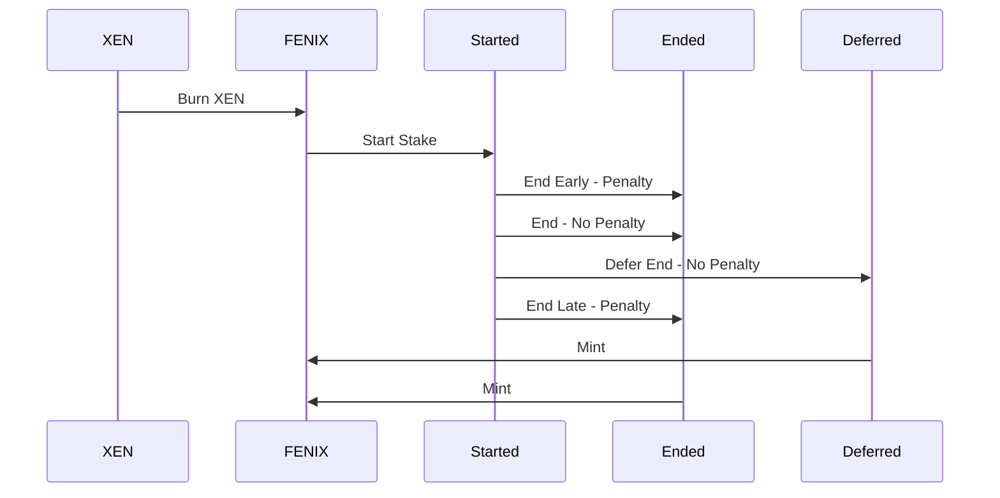
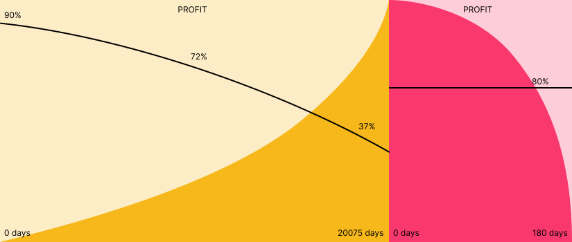

<picture>
  <source media="(prefers-color-scheme: dark)" srcset="./img/fenix-dark.svg">
  
</picture>

FENIX pays you to hold your own crypto

## Introduction

Since the birth of Bitcoin in 2009, counterparties have convinced investors to give them resources in exchange for the promise of secured funds and yield. Time and time again, we've seen these centralized counterparties fail. Failure modes include hacks, over leverage, insider trading, poor accounting, fraud, and opaque communication. Crypto was invented to get rid of middle men and remove counterparty risk. The FENIX protocol uses open source code on public blockchains to provide a [hyperstructure](https://jacob.energy/hyperstructures.html) that rewards crypto stakers for delayed gratification.

## Vision

FENIX is designed to reward crypto community members who believe in the crypto first principles of self-custody, transparency, trust through consensus, and permissionless value exchange without counterparty risk. FENIX's value is derived from the skills of the community members who have the freedom to assemble and create value for FENIX. Since no one party will own an outsized amount of the initial supply, it encourages the entire community to cooperate and coordinate. The FENIX token is minted from the ashes of burned XEN. XEN is the fastest growing cross-chain protocol with an initial vision of onboarding 100 million users into crypto.

## Features

**Equity**

Having an equitable initial investment distribution is crucial for ensuring that all stakeholders have an equal opportunity to participate and benefit from a project or venture. When investments are distributed fairly, it can help to reduce conflicts and promote a sense of shared ownership and responsibility. This can foster a more collaborative and inclusive environment, which is essential for the success of any project. An equitable investment distribution can also help to promote trust and transparency, as all parties are treated fairly and with respect. Overall, an equitable initial investment distribution is an essential component of a well-functioning and sustainable project or venture.

**Time In Market**

Having a long-term investment time horizon can be extremely beneficial for investors. This is because it allows for a more measured and disciplined approach to investing, as investors can focus on the long-term growth potential of their investments rather than being swayed by short-term market fluctuations. In addition, a long-term investment time horizon can help investors to weather economic downturns and market volatility, as they can hold onto their investments for a longer period of time until conditions improve. This can help to reduce the overall risk of investing and increase the likelihood of achieving long-term financial goals. Furthermore, a long-term investment time horizon can allow investors to take advantage of the power of compound growth, as their investments have more time to grow and accrue returns. Overall, having a long-term investment time horizon can be a key factor in building wealth and achieving financial success.

**Penalty Redistribution**

A system that redistributes penalties from investors who do not fulfill their commitments to those who do can be extremely valuable in promoting accountability and fairness in the investment process. Such a system can help to discourage investors from making commitments that they do not intend to fulfill, as they will be held financially responsible for their actions. This can help to build trust and confidence in the investment process, as investors know that they will be held accountable for their commitments. In addition, a system that redistributes penalties can help to level the playing field for all investors, as those who fulfill their commitments are not unfairly penalized while those who do not are not rewarded. Overall, a system that redistributes penalties can be a valuable tool in promoting integrity and fairness in the investment process.

## FENIX Principles

<table>
<tr>
<td>Simple</td>
<td>No Back Doors</td>
<td>Users Mint Their Equity</td>
</tr>
<tr>
<td>No Investor Allocation</td>
<td>No Team Allocation</td>
<td>Fair Launch</td>
</tr>
<tr>
<td>No Pre-Mine</td>
<td>No Origin Address</td>
<td>No Maximum Cap</td>
</tr>
<tr>
<td>Proof of Participation</td>
<td>Immutable</td>
<td>No Admin Keys</td>
</tr>
<tr>
<td>Starts at Zero Supply</td>
<td>No Management Team</td>
<td>Hyperstructure</td>
</tr>
<tr>
<td>No Sacrifice</td>
<td>No Initial Coin Offering</td>
<td></td>
</tr>
</table>

## Process

## Tokenomics

XEN to FENIX Ratio: `10_000`:`1`

### Burn

FENIX rises from the ashes of burned XEN. 10,000 XEN burned equals 1 FENIX.

$$
burnRatio = 10,000 XEN : 1FENIX
$$

When any FENIX user burns XEN they will be rewarded in accordance with the `burnRatio`

$$
FENIX = \frac{XEN}{10,000}
$$

### Adoption Reward

FENIX has a Adoption Reward for stakers that is created every time someone burns XEN to create FENIX. Each XEN Burn generates an original FENIX mint and a FENIX copy mint. The original FENIX mint goes to the staker's wallet and the FENIX copy mint goes to the reward pool. Every 13 weeks, anyone in the community can flush the reward pool into the staking pool granting extra FENIX to all of the stakers.

### Staking

#### Reward

<picture>
  <source media="(prefers-color-scheme: dark)" srcset="./img/stake-dark.svg">
  
</picture>

-  Stake & Early End Penalty Period - This time is between 0% and 100% of your stake term. The stake term can be between 1 day and 20075 days (55 years).

  > The closer you get to 100% of your stake completion, the more reward you receive.

-  Late End Penalty Period - This time frame is between 0% days and 100% after your stake matures. The end penalty period is between 0 days and 180 days.
  > The closer to 0% late for ending your stake, the more reward you receive.

#### Profit

<picture>
  <source media="(prefers-color-scheme: dark)" srcset="./img/profit-dark.svg">
  
</picture>

-  Stake & Early End Penalty Period - This time is between 0 and 20075 days (55 years) of your stake term. The longer you stake, the larger your reward will be.

  > Shorter stakes terms require completing a longer percent of time to break even.

-  Late End Penalty Period - This time frame is between 0 days and 180 days after your stake matures.
  > Your end stake break even is 143 days (80%) after your stake is mature.

#### Inflation Rate

FENIX has a fixed rate of inflation that is generated by stakers and paid to stakers. The supply of FENIX is uncapped. Outside of the Adoption Rewards, the inflation is fixed there are no other ways to produce FENIX. FENIX's inflation rate approximates to ϕ, the Golden Ratio.

$$
inflationRate = 1.618033988749894848%
$$

#### Stake Start

The stake start uses Time and Size bonus functions to calculate your equity stake in the pool (shares).

**Staking Time Bonus (_𝞃_):** The amplification of your bonus grows exponentially with your stake duration. The duration of a stake term is capped at 20075 days (55 years) but there are penalties for ending early and ending late.

$$
\tau=(\dfrac{fenix}{20075})^2
$$

**Staking Size Bonus (_𝛔_):** The amplification of a base stake's bonus is based on how much you stake. The size of a stake is capped by your wallet supply. The larger your stake, the larger your bonus.

$$
\sigma=-(\dfrac{1}{fenix}) + 1
$$

**Staking Total Bonus (_β_):** The sum of the time and size bonus calculated upon starting a stake. This total bonus generates a compound growth curve rewarding larger and longer stakes.

$$
\beta = fenix * e^{(\tau * 0.1 + \sigma * 0.9)}
$$

**Shares:** Your shares are your total bonus divided by your shareRate. The shares represent your equity in the staking pool.

$$
shares = \frac{\beta}{shareRate}
$$

#### Stake End

Ending your stake exists along two continuous functions. One function increases the percent of your stake before your target date and the other decreases the percent of your stake after your target date.

Ending a stake distributes the tokens into an owner's address, while redistributing any penalties to the staking pool. This function can only be triggered by the owner of the wallet.

**End Early (_𝝴_):** Ending a stake prematurely results in a penalty to the stake return. The longer the duration of a term is completed, the lower the penalty that is applied to that term. Lower penalties result in higher rewards.

$$
\epsilon=\dfrac{shares}{projectedBonus}
$$

**End Late (_𝝺_):** Ending a stake that is overdue results in penalties. The stake is penalized for 180 days until nothing is left. The penalty function is graceful and does not redistribute over 50% of your stake until day 143.

$$
\lambda=shares * \left(1-\left(\dfrac{lateDays}{180 days}\right)^3\right)
$$

#### Defer

Acknowledge that the owner still has access but is not yet ready to receive tokens. Early deferral can be trigger by the owner of the stake. Late deferral can be triggered by any smart contract user.

## Glossary

**Terms**

- _𝞃_ — (Tau/Time Bonus) The time bonus calculation for a stake. This bonus rewards a staker the longer delay gratification.
- _𝛔_ — (Sigma/Size Bonus) The size bonus calculation for a stake. This bonus rewards a staker more tokens based on the amount of tokens which are staked.
- _β_ — (Beta/Total Bonus) The total bonus which is the sum of the time bonus and the size bonus.
- _𝝴_ — (Epsilon/Early Penalty) The penalty for prematurely ending a stake. The penalty is costs the staker the square of a served term.
- _𝝺_ — (Lamda/Late Penalty) The penalty window for ending a stake. A staker will lose a percentage of total earnings over the course of 180 days. At the end of 180 day, the stake reward will be 0.

## Acknowledgements

- [Bitcoin](https://github.com/bitcoin/bitcoin) (Jan 8, 2009) — Censorship resistant zero counter party risk value storage and transfer
- [Cereneum](https://github.com/Cereneum/Cereneum) (Jun 6, 2019) — Time-based interest-bearing Cryptographic Certificate of Interest
- [HEX](https://github.com/BitcoinHEX/contract) (Dec 2, 2019) — Share rate ratcheting increasing the cost basis for later stakers
- [Uniswap V2](https://github.com/Uniswap/v2-core) (May 18, 2020) — Equity based liquidity pools
- [XEN Crypto](https://github.com/FairCrypto/XEN-crypto) (Oct 8, 2022) — Cross-chain protocol launch
