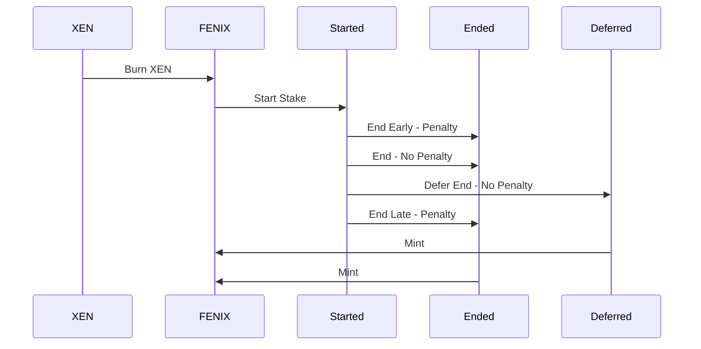

# FENIX

## Vision

FENIX is a crypto first prinicple [hyperstructure](https://jacob.energy/hyperstructures.html) that rewards crytpo stakers for delayed gratifiction.

FENIX is designed to reward crypto community members who believe in cryptos first principles of self-custody, transparency, trust through consensus, and permissionless value exchange without counterparty risk. FENIX's value is derrived from the skills of the community members who have the freedom to assemble and create value for FENIX. Since no one party will own an outsided amount of the supply, it encoruages the entire community to cooproate and coordiate. The FENIX token is minted by burning XEN, the fasest and most widely adopted token in crypto. XEN is a cross-chain protocol with a vision of onboarding as many users into crypto as possible.

## Principles

<table>
<tr>
<td>Simple</td>
<td>No Back Doors</td>
<td>Users Mint Their Equity</td>
</tr>
<tr>
<td>No Investor Allocation</td>
<td>No Team Allocation</td>
<td>Fair Launch</td>
</tr>
<tr>
<td>No Pre-Mine</td>
<td>No Origin Address</td>
<td>No Maximum Cap</td>
</tr>
<tr>
<td>Proof of Wait</td>
<td>Immutable</td>
<td>No Admin Keys</td>
</tr>
<tr>
<td>Starts at Zero Supply</td>
<td>No Management Team</td>
<td>Hyperstructure</td>
</tr>
<tr>
<td>No Sacrifice</td>
<td>No Initial Coin Offering</td>
<td></td>
</tr>
</table>

## Process

## Tokenomics
<svg  width="100%" viewBox="0 0 1823 700" version="1.1" xmlns="http://www.w3.org/2000/svg" xmlns:xlink="http://www.w3.org/1999/xlink">
    <title>stake</title>
    <g id="Page-1" stroke="none" stroke-width="1" fill="none" fill-rule="evenodd">
        <g id="Slide-16:9" transform="translate(-26.000000, -376.000000)">
            <g id="stake" transform="translate(26.000000, 376.000000)">
                <g id="Process-Background" opacity="0.1">
                    <rect id="Earn" fill="#98FF1E" x="0" y="0" width="1095" height="700"></rect>
                    <rect id="Lose" fill="#FF1E30" x="1123" y="0" width="700" height="700"></rect>
                    <rect id="Grace" fill="#1EE9FF" x="1095" y="0" width="28" height="700"></rect>
                </g>
                <g id="Process-Fill">
                    <path d="M1095.00678,0 L1095.00678,700 L0,700 C421.940104,595.385417 705.550781,477.5 850.832031,346.34375 C996.113281,215.1875 1077.50487,99.7395833 1095.00678,0 Z" id="Earn" fill="#98FF1E"></path>
                    <polygon id="Lose" fill="#FF1E30" points="1123 0 1823 700 1123 700"></polygon>
                    <rect id="Grace" fill="#1EE9FF" x="1095" y="0" width="28" height="700"></rect>
                </g>
            </g>
        </g>
    </g>
</svg>

-  Stake & Early End Penalty Period
-  End Stake & Grace Period
-  Late End Penalty Period

#### Get Equity Tokens

FENIX uses the proof-of-burn function from XEN. To mint FENIX, burn XEN, the amount burned per address will determine the base FENIX supply which can be used for staking.
$$
base=\log_{1.5}\left(BurnedXEN\right)
$$

#### Stake Start

**Time Bonus:** The amplificatoin a base stake's bonus compounding at 20% APY. The duration of a stake term is uncapped but there are penalties for ending early and ending late.
$$
\tau=base* \left(\frac{days}{365 days}\right) * 20\%
$$
**Size Bonus:** The amplificatoin of a base stake's bonus using the natural log of the base rate. The size of a stake is uncapped but consolidating a stake yields more rewards.
$$
\sigma=ln(base)
$$
**Total Bonus:** The sum of the time and size bonus calculated upon starting a stake.
$$
\beta = \tau + \sigma
$$

**Total Stake:** The sum of the base FENIX plus the bonus FENIX
$$
stake = base + \beta
$$

#### Stake End + Penalty

**End Early:** Ending a stake prematurely results in a penalty to the stake return. The longer the duration of a term is compelted, the lower the penalty that is applied to that term. Lower penalties result in higher rewards.
$$
\epsilon=\left(base + bonus\right) * \left(\dfrac{blockTs - stakeTs}{term}\right)^2
$$
**End Late** Ending a stake that is overdue results in panlties. The stake is penalized one percent of the total earnings every week until nothing is left.
$$
\lambda=\left(base + bonus\right) * \left(\dfrac{lateDays}{7 days * 100 weeks}\right)
$$

#### Stake End + No Penalty

There are two ways to end a stake. Upon ending a stake, the FENIX will calculate the return generated from the stake and increase the shares proportionally. There is a four week grace period allowing the completion of a stake without any early or late end stake penalties.

$$
\gamma= 7 days * 4 weeks
$$

- **Defer** Acknowledge that the owner still has access but is not yet ready to receive tokens. This can be triggered by anyone.
- **Now** Distributes the tokens into owner address address. This function can only be triggered by the owner of the wallet.

## Glossary

**Terms**

- _base_  — The base FENIX token used in a stake
- _𝞃_  — (Tau/Time Bonus) The time bonus caluclating for a stake. This bonus rewards a staker the longer longer delay gratificaiton by issuing a bonus of `20%` APY every  year.
- _𝛔_  — (Sigma/Size Bonus) The size bonus calculation for a stake. This bonus rewards a staker more tokens based on  the amount of tokens which are staked.
- _β_  — (Beta/Total Bonus) The total bonus which is the sum of the time bonus and the size bonus.
- _𝝲_  — (Gamma/Grace Period) The grace window for ending your stake calculated at 28 days (4 weeks). This window gives a staker time to end a stake without incurring any penalties.
- _𝝴_ — (Epsilon, Early Penalty) The penality for prematurely ending a stake. The penality is costs the staker the square of a serverd term.
- **_𝝺_**  — (Lamda/Late Penalty) The penalty window for ending a stake. A staker will lose `1%` of total earnings every week over the course of 100 weeks. At the end of 100 weeks, the stake reward will be 0.

**Functions**

- `function burnXEN(uint256 xen)` — Burns XEN to convert into FENIX
- `function startStake(address burnAddress, uint256 term` — Starts a Stake based on Burned XEN for a term duration expressed in days
- `function startStake(uint256 FENIX, uint256 term)` — Starts a stake with FENIX for a term duration expressed in days
- `function deferStake(uint256 stakeId)` — Indefinnitely defers the ending of a stake during the grace period
- `function endStake(uint256 stakeId)` — Ends a stake minting FENIX into the stakers wallet
- `function calculateBase(uint256 xen)` — Calculates the base FENIX from XEN
- `function calculateBonus(uint256 xen, uint256 term)` — Calculates the Bonus FENIX based on the term and the amount of FENIX
- `function updateEquity(Stake memory stake)` — Updates the equity share rate based on the maximum return on investment any users has ever reached in the system.
- `function calculateEarlyPenalty(Stake memory stake)` — Calculates the early end stake penalty from a stake
- `function calculateLatePenalty(Stake memory stake)` — Calculates the late end stake penalty from a stake

