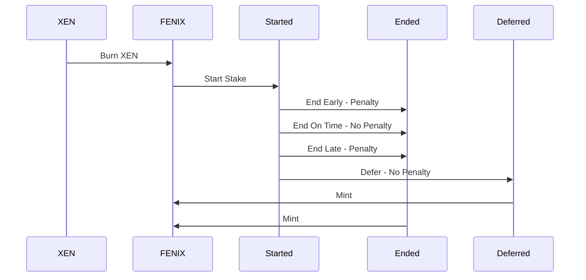
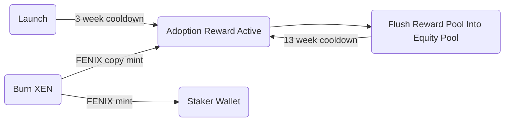
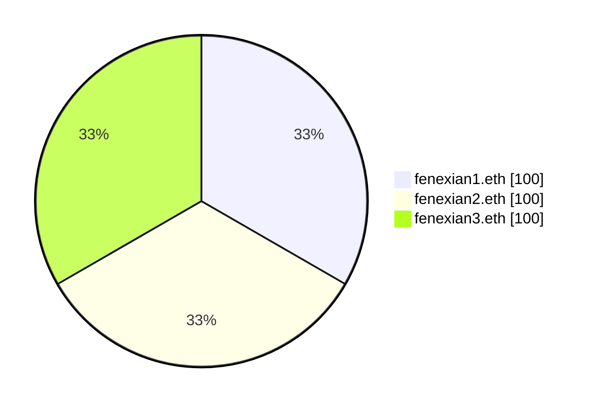
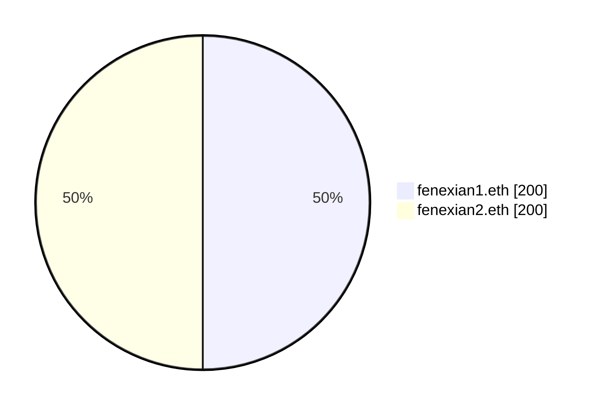

<picture>
  <source media="(prefers-color-scheme: dark)" srcset="./img/fenix-dark.svg">
  
</picture>

<h4 align="center">
Empower your crypto, earn while you hold!
</h4>

Joe Blau • Engineering • <a href = "mailto:joe@atomize.xyz">joe@atomize.xyz</a>
 
Johad Ellis • Product • <a href = "mailto:johad@atomize.xyz">johad@atomize.xyz</a> 

## Introduction

Since the birth of Bitcoin in 2009, counterparties have convinced investors to give them resources in exchange for the promise of secured funds and yield. Time and time again, we've seen these centralized counterparties fail. Failure modes include hacks, over-leverage, insider trading, poor accounting, fraud, and opaque communication. Crypto was invented to eliminate middlemen and remove counterparty risk. The FENIX protocol uses open-source code on public blockchains to provide a [hyperstructure](https://jacob.energy/hyperstructures.html) that rewards crypto stakers for delayed gratification.

## Vision

FENIX is designed to reward crypto community members who believe in the "crypto-first" principles of self-custody, transparency, trust through consensus, and permissionless value exchange without counterparty risk. FENIX's value is derived from the skills of the community members, who have the freedom to assemble and create value for FENIX. Since no single party will own an outsized amount of the initial supply, it encourages the entire community to cooperate and coordinate. The FENIX token is minted from the ashes of burned XEN. XEN is the fastest-growing cross-chain protocol with an initial vision of onboarding 100 million users into crypto.

## Features

### Equity

The value of equity lies in the potential for long-term growth and wealth creation. By owning a stake in an asset, you gain the opportunity to benefit from its appreciation in value over time. Equity investments not only provide you with the chance to diversify your financial portfolio but also to participate in the success of innovative projects. As the investment grows and prospers, your equity increases in value, contributing to your overall financial well-being and security. Additionally, equity investments may generate passive income through dividends or derivatives, further enhancing the value proposition of owning equity in an asset.

### Time In Market

A long-term investment time horizon presents a wealth of benefits, leading to enhanced financial success and stability. By embracing this approach, investors can harness the power of compounding returns, as reinvested dividends and capital gains accelerate wealth creation over time. Furthermore, a long-term perspective helps mitigate risks by allowing investors to weather market fluctuations and economic cycles, while reducing impulsive decision-making based on temporary conditions. This extended time frame also offers the opportunity for greater growth potential and reduced transaction costs, as investors can minimize trading frequency, resulting in lower fees and taxes. Ultimately, adopting a long-term investment mindset fosters emotional stability and discipline, easing the anxiety associated with short-term market volatility, and paving the way for more robust financial growth and security.

### Penalty Redistribution

A penalty redistribution system is valuable for many reasons. It encourages investors to keep their promises by rewarding those who do and punishing those who don't. This creates a stable and reliable investment environment. The system also compensates investors who follow the rules, making them feel confident and satisfied. It helps maintain a well-functioning investment platform by promoting responsibility and accountability. The system is fair because it rewards good behavior and punishes bad behavior, making investors trust that their interests are protected. Overall, this system helps everyone by encouraging good behavior, keeping investments stable, and creating a fair and trustworthy environment.

## FENIX Principles

<table>
<tr>
<td>Simple</td>
<td>No Back Doors</td>
<td>Users Mint Their Equity</td>
</tr>
<tr>
<td>No Investor Allocation</td>
<td>No Team Allocation</td>
<td>Fair Launch</td>
</tr>
<tr>
<td>No Pre-Mine</td>
<td>No Origin Address</td>
<td>No Maximum Cap</td>
</tr>
<tr>
<td>Proof of Participation</td>
<td>Immutable</td>
<td>No Admin Keys</td>
</tr>
<tr>
<td>Starts at Zero Supply</td>
<td>No Management Team</td>
<td>Hyperstructure</td>
</tr>
<tr>
<td>No Sacrifice</td>
<td>No Initial Coin Offering</td>
<td></td>
</tr>
</table>

## Process

## Tokenomics

XEN to FENIX Ratio: `10_000`:`1`

### Burn

FENIX rises from the ashes of burned XEN. 10,000 XEN burned equals 1 FENIX.

$$
burnRatio = 10,000 XEN : 1FENIX
$$

When any FENIX user burns XEN they will be rewarded in accordance with the `burnRatio`

$$
\frac{XEN}{10,000} = FENIX
$$

> **_Note:_** Fixed Burn Ratio
>
> The burn ratio is fixed. Since XEN is disinflationary, it will become increasingly difficult to burn XEN for FENIX.

### Pools

#### Adoption Reward Pool

FENIX offers an Adoption Reward for stakers, which is generated every time someone burns XEN to create FENIX. Each XEN burn results in both an original FENIX mint and a FENIX copy mint. The original FENIX mint is sent to the staker's wallet, while the FENIX copy mint is allocated to the reward pool.

> **_Note:_** Payday Pool Party
>
> Every 13 weeks, FENIX hosts a Payday Pool Party. This event can be triggered by any on-chain contract (user, bot) and allows the flushing of the Reward Pool into the Equity Pool. This inflationary event rewards stakers in direct proportion to their shares in the Equity Pool.

#### Equity Pool

FENIX manages inflation through an equity pool, allowing inflation to be added and removed from the pool while distributing equity to stakers in a gas-efficient manner. When users initiate stakes, they increase the size of the pool, and when they end stakes, they reduce the pool's size. As the size of the pool is dynamic, it does not require any additional accounting beyond knowing the stakers' equity positions.

1. Three addresses stake 100 FENIX each. The Equity Pool is 300 FENIX.

2. 300 FENIX in new inflation is added to the Equity Pool which could be from new stakers or Adoption Reward. The new Equity Pool total is 600 FENIX.

3. `fenexian3.eth` ends their Stake, which removes their supply from the Equity Pool. `fenexian3.eth` mints 200 FENIX. The new Equity Pool total is 400 FENIX.

### Staking

<picture>
  <source media="(prefers-color-scheme: dark)" srcset="./img/stake-dark.svg">
  
</picture>

-  Stake & Early End Penalty Period - This period ranges from 0% to 100% of your stake term. The stake term can last anywhere from 1 day to 7,665 days (21 years). Your stake will typically break even when approximately 71% of your stake term is completed.
-  Late End Penalty Period - This timeframe spans from 0 days to 180 days after your stake matures. Your late stakes will break even if you end them sooner than approximately 143 days from your stake's maturity date.

#### Inflation

##### Rate

FENIX features a fixed rate of inflation, generated by stakers and paid to stakers. The supply of FENIX is uncapped. Apart from the Adoption Rewards, the inflation rate is fixed, with no other means to produce FENIX. FENIX's inflation rate approximates ϕ, the Golden Ratio.

$$
inflationRate = 1.618033988749894848
$$

##### Calculation

The inflation is compounded based on your initial FENIX stake size.

$$
inflation = fenix * (1 + \dfrac{inflationRate}{100})^\frac{term}{366 days}
$$

> **_Note:_** Equity Pool
>
> Inflation is injected into the Equity Pool as soon as a stake begins. The only way for stakers to capture the return is by waiting until their specified stake term is complete and ending the stake on the selected day.

#### Stake Start

The stake start utilizes Time and Size bonus functions to calculate your equity stake in the pool (shares).

##### Time Bonus (_𝞃_):

The amplification of your bonus grows exponentially with your stake duration. The duration of a stake term is capped at 7,665 days (21 years), but there are penalties for ending early and ending late.

$$
\tau=1 + (\dfrac{term}{7665})
$$

##### Size Bonus (_𝛔_):

The amplification of a base stake's bonus is based on the amount you stake. The size of a stake is limited by your wallet supply. The larger your stake, the larger your bonus.

$$
\sigma=1 - (\dfrac{1}{fenix})
$$

##### Total Bonus (_β_):

The sum of the time and size bonuses is calculated upon starting a stake. This total bonus generates a compound growth curve, rewarding larger and longer stakes.

$$
\beta = \sigma * e^{(\tau)}
$$

##### Shares:

Your shares are determined by dividing your total bonus by your `shareRate`. The shares represent your equity in the staking pool.

$$
shares = \frac{\beta}{shareRate}
$$

> **_Note:_** Share Rate
>
> When a stake is ended, FENIX calculates the inflation paid to the owner. If the owner has a higher gain than the maximum return on investment ever received, the `shareRate` is updated to reflect the highest possible return. This share rate ratchet mechanism ensures that later stakers can never get a better deal for the same economic energy staked into the contract.

#### Stake Defer

Acknowledge that the owner still has access but is not yet ready to receive tokens. Early deferral can be triggered by the owner of the stake. Late deferral can be triggered by any smart contract user.

#### Stake End

Ending your stake exists along two continuous functions. One function increases the percentage of your stake before your target date, and the other decreases the percentage of your stake after your target date.

Ending a stake distributes the tokens to the owner's address while redistributing any penalties to the staking pool. This function can only be triggered by the owner of the wallet.

##### End Early (_𝝴_):

Ending a stake prematurely results in a penalty to the stake return. The more of a term's duration that is completed, the lower the penalty applied to that term. Lower penalties result in higher rewards.

$$
\epsilon=\left(\dfrac{blockTs - stakeTs}{term}\right)^2
$$

##### End Late (_𝝺_):

Ending an overdue stake results in penalties. The stake is penalized for 180 days until nothing is left. The penalty function is graceful and does not redistribute over 50% of your stake until day 143.

$$
\lambda=1 - \left(\dfrac{lateDays}{180 days}\right)^3
$$

## Glossary

**Terms**

- **_𝞃_** — (Tau/Time Bonus) The time bonus calculation for a stake. This bonus rewards a staker for longer delayed gratification.
- **_𝛔_** — (Sigma/Size Bonus) The size bonus calculation for a stake. This bonus rewards a staker with more tokens based on the number of tokens staked.
- **_β_** — (Beta/Total Bonus) The total bonus, which is the sum of the time bonus and the size bonus.
- **_𝝴_** — (Epsilon/Early Penalty) The penalty for prematurely ending a stake. The penalty costs the staker the square of the served term.
- **_𝝺_** — (Lamda/Late Penalty) The penalty window for ending a stake. A staker will lose a percentage of total earnings over the course of 180 days. At the end of 180 days, the stake reward will be 0.

## Acknowledgements

- **Bitcoin (Jan 8, 2009)** — Censorship-resistant, zero counterparty risk value storage and transfer

  - Links: [Source Code](https://github.com/bitcoin/bitcoin) • [Website](https://bitcoin.org)

- **Uniswap V1 (Nov 2, 2018)** — Equity-based liquidity pool

  - Links: [Source Code](https://github.com/Uniswap/v1-contracts) • [Website](https://uniswap.org) • [Contract](https://etherscan.io/token/0x1f9840a85d5af5bf1d1762f925bdaddc4201f984)
  - Influential Concepts:
    - Liquidity Pools - [Equity Pool](#equity-pool)

- **Cereneum (Jun 6, 2019)** — Time-based, interest-bearing Cryptographic Certificate of Interest

  - Links: [Source Code](https://github.com/Cereneum/Cereneum) • [Website](https://web.archive.org/web/20190622004643/https://www.cereneum.com/) • [Contract](https://etherscan.io/token/0xd9D4A7CA154fe137c808F7EEDBe24b639B7AF5a6)
  - Influential Concepts:
    - Staking Longer Pays More - [Time Bonus](#size-bonus-𝛔)
    - EndStakeForAFriend - [Defer](#stake-defer)
    - Robin Hood Bonus - [Adoption Reward](#adoption-reward-pool)
    - Early Unstake Penalty - [End Early](#end-early-𝝴)
    - Late Unstake Penalty - [End Late](#end-late-𝝺)

- **HEX (Dec 2, 2019)** — Share rate ratcheting, increasing the cost basis for later stakers

  - Links: [Source Code](https://github.com/BitcoinHEX/contract) • [Website](https://hex.com) • [Contract](https://etherscan.io/token/0x2b591e99afE9f32eAA6214f7B7629768c40Eeb39)
  - Influential Concepts:
    - Bigger Pays Better - [Size Bonus](#size-bonus-𝛔)
    - T-Shares - [Shares](#shares)

- **XEN Crypto (Oct 8, 2022)** — Cross-chain protocol launch
  - Links: [Source Code](https://github.com/FairCrypto/XEN-crypto) • [Website](https://faircrypto.org) • [Contract](https://etherscan.io/token/0x06450dEe7FD2Fb8E39061434BAbCFC05599a6Fb8)
  - Influential Concepts:
    - First Principles - [First Principles](#fenix-principles)
    - Proof of Burn - [Burn](#shares)
