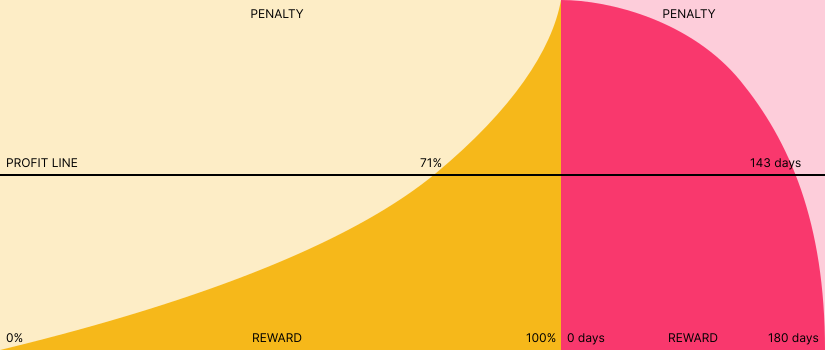

<picture>
  <source media="(prefers-color-scheme: dark)" srcset="./img/fenix-dark.svg">
  
</picture>

FENIX pays you to hold your own crypto

## Introduction

Since the birth of Bitcion in 2009, counterparties have convinced investors to give them resource in exchange for the promise of secured funds and yield. Time and time again, we've seen these centralized counterparties fail. Failure modes include hacks, over leverage, insider trading, poor accounting, and opaque communication. Crypto provides a solution with transparent censorship resistant zero counterparty risk value system. FENIX leverages open source code on public blockchains to provide a [hyperstructure](https://jacob.energy/hyperstructures.html) that rewards crypto stakers for delayed gratification.

## Vision

FENIX is designed to reward crypto community members who believe in cryptos first principles of self-custody, transparency, trust through consensus, and permissionless value exchange without counterparty risk. FENIX's value is derived from the skills of the community members who have the freedom to assemble and create value for FENIX. Since no one party will own an outsized amount of the supply, it encourages the entire community to cooperate and coordinate. The FENIX token is minted by burning XEN, the fastest and most widely adopted token in crypto. XEN is a cross-chain protocol with a vision of onboarding as many users into crypto as possible.

## XEN Upgrades

**Equity**

FENIX compresses the resource gap in the XEN minting process. We believe in an equitable start which means that people should all have the opportunity to start at a similar place regardless of resources. This however does not mean that everyone will end the same — Your end is based on your time bonus, size, self custody, sovereignty, and responsibly ending your stake.

**Time In Market**

FENIX expands XEN staking to indefinite time preference. We believe that value is built over long term time horizons. FENIX allows you to create daily or multi-generational stakes that can be passed to future generations.

## Principles

<table>
<tr>
<td>Simple</td>
<td>No Back Doors</td>
<td>Users Mint Their Equity</td>
</tr>
<tr>
<td>No Investor Allocation</td>
<td>No Team Allocation</td>
<td>Fair Launch</td>
</tr>
<tr>
<td>No Pre-Mine</td>
<td>No Origin Address</td>
<td>No Maximum Cap</td>
</tr>
<tr>
<td>Proof of Wait</td>
<td>Immutable</td>
<td>No Admin Keys</td>
</tr>
<tr>
<td>Starts at Zero Supply</td>
<td>No Management Team</td>
<td>Hyperstructure</td>
</tr>
<tr>
<td>No Sacrifice</td>
<td>No Initial Coin Offering</td>
<td></td>
</tr>
</table>

## Process

## Tokenomics

<picture>
  <source media="(prefers-color-scheme: dark)" srcset="./img/stake-dark.svg">
  
</picture>

-  Stake & Early End Penalty Period
-  Late End Penalty Period

#### Get Equity Tokens

FENIX uses the proof-of-burn function from XEN. To mint FENIX, burn XEN, the amount burned per address will determine the base FENIX supply which can be used for staking.

$$
base=\log_{1.5}\left(BurnedXEN\right)
$$

#### Stake Start

**Time Bonus:** The amplification a base stake's bonus compounding at 20% APY. The duration of a stake term is uncapped but there are penalties for ending early and ending late.

$$
\tau=base* \left(\frac{days}{365 days}\right) * 20\%
$$

**Size Bonus:** The amplification of a base stake's bonus using the natural log of the base rate. The size of a stake is uncapped but consolidating a stake yields more rewards.

$$
\sigma=ln(base)
$$

**Total Bonus:** The sum of the time and size bonus calculated upon starting a stake.

$$
\beta = \tau + \sigma
$$

**Total Stake:** The sum of the base FENIX plus the bonus FENIX

$$
stake = base + \beta
$$

#### Stake End + Penalty

**End Early:** Ending a stake prematurely results in a penalty to the stake return. The longer the duration of a term is completed, the lower the penalty that is applied to that term. Lower penalties result in higher rewards.

$$
\epsilon=\left(base + bonus\right) * \left(\dfrac{blockTs - stakeTs}{term}\right)^2
$$

**End Late** Ending a stake that is overdue results in penalties. The stake is penalized one percent of the total earnings every week until nothing is left.

$$
\lambda=\left(base + bonus\right) * \left(\dfrac{lateDays}{7 days * 100 weeks}\right)
$$

#### Stake End + No Penalty

There are two ways to end a stake. Upon ending a stake, the FENIX will calculate the return generated from the stake and increase the shares proportionally. There is a four week grace period allowing the completion of a stake without any early or late end stake penalties.

$$
\gamma= 7 days * 4 weeks
$$

- **Defer** Acknowledge that the owner still has access but is not yet ready to receive tokens. This can be triggered by anyone.
- **Now** Distributes the tokens into owner address address. This function can only be triggered by the owner of the wallet.

## Glossary

**Terms**

- _base_ — The base FENIX token used in a stake
- _𝞃_ — (Tau/Time Bonus) The time bonus calculating for a stake. This bonus rewards a staker the longer longer delay gratification by issuing a bonus of `20%` APY every year.
- _𝛔_ — (Sigma/Size Bonus) The size bonus calculation for a stake. This bonus rewards a staker more tokens based on the amount of tokens which are staked.
- _β_ — (Beta/Total Bonus) The total bonus which is the sum of the time bonus and the size bonus.
- _𝝲_ — (Gamma/Grace Period) The grace window for ending your stake calculated at 28 days (4 weeks). This window gives a staker time to end a stake without incurring any penalties.
- _𝝴_ — (Epsilon, Early Penalty) The penalty for prematurely ending a stake. The penalty is costs the staker the square of a served term.
- **_𝝺_** — (Lamda/Late Penalty) The penalty window for ending a stake. A staker will lose `1%` of total earnings every week over the course of 100 weeks. At the end of 100 weeks, the stake reward will be 0.
